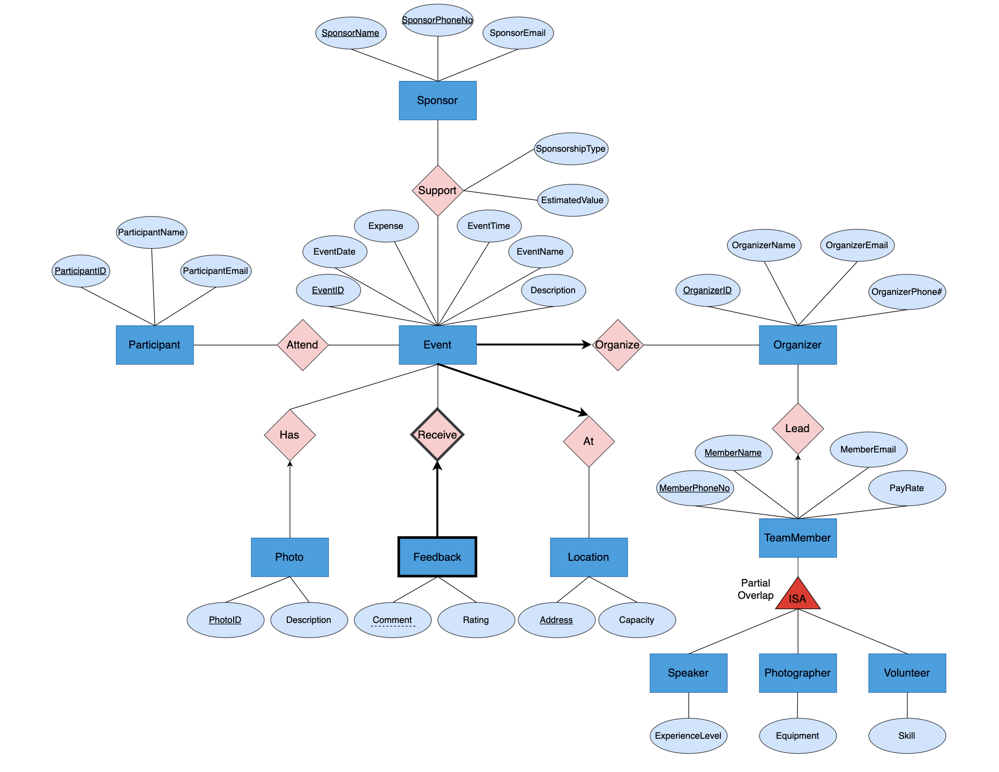

# UBC Event Collection Application
## 1. Application Description
The UBC Event Collection Application is designed to gather the comprehensive information of an event in the UBC community. It aims to simplify the process of tracking the event-related data. To achieve the goals mentioned above, the database will include the following entities: Event, Organizer, Staff, Location, Photo, Participant, Feedback, Sponsor. Each of these entities has crucial information regarding the event, thus ensuring that the application effectively collects and stores all the essential data. 

Our project focuses on addressing several critical aspects within the domain of Event Management:

- **Event Information**: Our database models essential event details such as event names, dates, times, descriptions, photos, and locations.  This enables event organizers to create, store, and categorize event data efficiently.
- **Participant Management**: We manage participant data, including their contact information, registration history, and feedback. This ensures a seamless participant experience and enables event organizers to communicate with attendees.
- **Sponsorship and Partnerships**: Our database handles sponsorship and partnership details, tracking the involvement of sponsors, and their contributions. This is crucial for event financing and collaboration.
- **Event Staff**: We manage diverse event staff roles, from organizers and speakers to photographers and volunteers. Staff information may include personal/contact details, and pay rate, ensuring efficient event execution.

## 2. Database Specifications
Users of the Event Collection database will have various capabilities and actions at their disposal. For attendees of the event, they are able to discover events based on different criteria, view event details, and leave feedback for the event. For organizers of the event, they are able to manage the staff enrolled in the event, and view information of the event sponsors. Sponsors can utilize the application's database to meticulously monitor and maintain a comprehensive record of their sponsorship history, including past events they've supported, contribution details, and engagement history.

## 3. Description of the application platform
The project will utilize the **Oracle database**, which is provided by the department, as the foundational database management system. It will be built using a technology stack that includes **JavaScript** with **React** for the frontend and **Node.js** for the backend. On the frontend, React will enable the creation of interactive and responsive user interfaces. For the backend, Node.js will serve as the server-side runtime. Additionally, Express.js, a web application framework for Node.js, will simplify the process of building APIs and handling HTTP requests. 

## 4. ER Diagram
